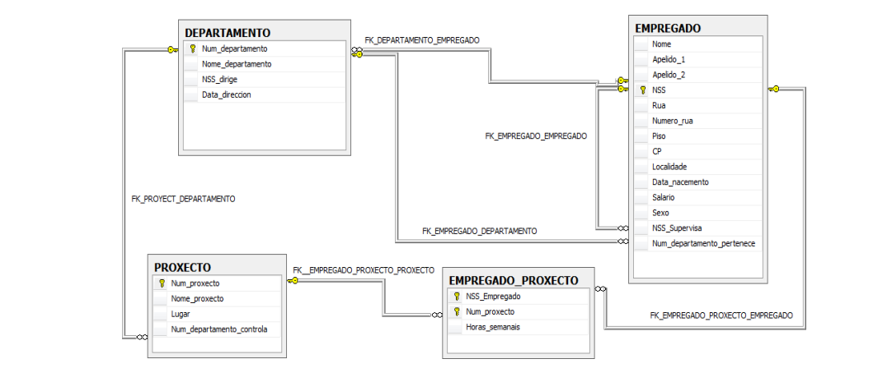

# Enunciado del ejercicio

# Índice

- [Creación de la estructura de una base de datos en diferentes SGBD](#creación-de-la-estructura-de-una-base-de-datos-en-diferentes-sgbd)
    - [1) Creación de la estructura de una base de datos en diferentes SGBD](#1-creación-de-la-estructura-de-una-base-de-datos-en-diferentes-sgbd)
- [2) Ejecución de sentencias de consulta y modificación de datos y procedimientos almacenados](#2-ejecución-de-sentencias-de-consulta-y-modificación-de-datos-y-procedimientos-almacenados)
    - [Ejercicio 2.1: Actualización de datos utilizando la interfaz `Statement`](#ejercicio-21-actualización-de-datos-utilizando-la-interfaz-statement)
    - [Ejercicio 2.2: Consulta de datos utilizando la interfaz `Statement`](#ejercicio-22-consulta-de-datos-utilizando-la-interfaz-statement)
    - [Ejercicio 2.3: Actualización de datos utilizando la interfaz `PreparedStatement`](#ejercicio-23-actualización-de-datos-utilizando-la-interfaz-preparedstatement)
    - [Ejercicio 2.4: Consulta de datos utilizando la interfaz `PreparedStatement`](#ejercicio-24-consulta-de-datos-utilizando-la-interfaz-preparedstatement)
    - [Ejercicio 2.5: Ejecución de procedimientos almacenados y funciones](#ejercicio-25-ejecución-de-procedimientos-almacenados-y-funciones)
    - [Ejercicio 2.6: Gestión del resultado de una consulta](#26-xestión-do-resultado-dunha-consulta)
- [3) Acceso a los metadatos](#3-acceso-aos-metadatos)
    - [Ejercicio 3.1: Obtención de información sobre el SGBD y la conexión](#exercicio-31-obtención-de-información-sobre-o-sxbd-e-a-conexión)
    - [Ejercicio 3.2: Acceso a los metadatos referente a las tablas y procedimientos](#exercicio-32-acceso-aos-metadatos-referente-ás-táboas-e-os-procedementos)
    - [Ejercicio 3.3: Acceso a los metadatos referente a funciones, procedimientos y características disponibles del SGBD](#exercicio-33-acceso-aos-metadatos-referente-ás-funcións-procedementos-e-características-dispoñibles-do-sxbd)
    - [Ejercicio 3.4: Acceso a los metadatos de los límites impuestos por el conector](#exercicio-34-acceso-aos-metadatos-dos-límites-impostos-polo-conectador)
    - [Ejercicio 3.5: Metadatos sobre las transacciones](#exercicio-35-metadatos-sobre-as-transaccións)
    - [Ejercicio 3.6: Métodos sobre el soporte de características](#exercicio-36-métodos-sobre-o-soporte-de-características)
    - [Ejercicio 3.7: Metadatos del `ResultSet`](#exercicio-37-metadatos-do-resultset)

## Creación de la estructura de una base de datos en diferentes SGBD

## 1) Creación de la estructura de una base de datos en diferentes SGBD

Utilizando un editor de texto, por ejemplo, el Bloc de Notas, WordPad o cualquier otro similar, crea un script con el nombre `ScriptEmpresa.sql` para crear la siguiente estructura de una base de datos que almacena información sobre empleados, departamentos y proyectos de una empresa, tal como se describe en el diagrama relacional. Este script luego lo ejecutaremos en MySQL para crear la estructura.

### Requisitos de almacenamiento de la empresa:

- La empresa está organizada en departamentos. Cada departamento tiene un nombre único, un número único y un empleado que lo dirige. También se guarda la fecha en la que dicho empleado comenzó a dirigir el departamento.

- Cada departamento controla un cierto número de proyectos, cada uno de ellos tiene un número y nombre únicos, y se realiza en un solo lugar.

- Cada empleado tiene un nombre, número de seguridad social, dirección, salario, sexo, fecha de nacimiento y puede tener un supervisor. Todo empleado está asignado a un departamento, pero puede trabajar en varios proyectos, que no necesariamente estarán controlados por el mismo departamento. También se almacena el número de horas semanales que un empleado trabaja en cada proyecto.

- El diagrama relacional de las relaciones se muestra a continuación. También aparecen en el diagrama las claves primarias y foráneas.


### Instrucciones:

1. Crea una base de datos llamada `BDEmpresa` en el SGBD MySQL y ejecuta el script `ScriptEmpresa.sql` para crear la estructura de la base de datos. Luego, verifica que la estructura se haya creado correctamente.

2. Establece conexión mediante tu IDE (Netbeans/IntelliJ).

3. Usando el script `EmpresaInsertarDatos.sql`, inserta datos en todas las tablas de la base de datos `BDEmpresa`. Para evitar problemas por restricciones de clave foránea, desactiva estas restricciones antes de insertar los datos, y al final, vuelve a activarlas. Para desactivar o activar una restricción en MySQL, utiliza la instrucción:

   ```sql
   SET FOREIGN_KEY_CHECKS=0;  -- Desactiva la comprobación de claves foráneas
   SET FOREIGN_KEY_CHECKS=1;  -- Activa la comprobación de claves foráneas

## 2) Ejecución de sentencias de consulta y modificación de datos y procedimientos almacenados.

Realiza un programa en Java para establecer una conexión con el SGBD MySQL, que acceda a la base de datos **BDEmpresa**, implemente y llame los métodos que se detallan a continuación. Para ejecutar las sentencias, utiliza la interfaz `Statement` y controla los posibles errores. Separa la llamada a los métodos de su implementación en diferentes clases. La estructura de la base de datos **BDempresa** es la siguiente. Ten en cuenta que el nombre del departamento y el nombre del proyecto son únicos, y las acciones de las restricciones de claves foráneas para las operaciones de eliminación y modificación son "No Action":



### Ejercicio 2.1: Actualización de datos utilizando la interfaz `Statement`.

a) Crea un método para aumentar el salario de los empleados de un departamento determinado. El método recibirá como parámetros la cantidad a aumentar y el nombre del departamento.

b) Crea un método para insertar un nuevo departamento. El método recibirá como parámetros el número, el nombre del departamento y el NSS del empleado director. La fecha de inicio del director del departamento será la fecha del sistema.

c) Crea un método para eliminar un empleado de un proyecto. El método recibirá como parámetros el NSS del empleado y el número del proyecto.

### Ejercicio 2.2: Consulta de datos utilizando la interfaz `Statement`.

En el programa anterior, añade un método para visualizar los nombres, apellidos, localidad, salario, fecha de nacimiento, nombre del jefe de empleado y el nombre del departamento donde trabajan aquellos empleados de una determinada localidad. El método recibirá como parámetro el nombre de la localidad.

### Ejercicio 2.3: Actualización de datos utilizando la interfaz `PreparedStatement`.

Realiza un programa en Java para establecer una conexión con el SGBD MySQL, que acceda a la base de datos **BDEmpresa**, implemente y llame los siguientes métodos. Utiliza sentencias pre-compiladas (preparadas) y controla los posibles errores.

a) Crea un método para cambiar el departamento que controla un proyecto. El método recibirá como parámetros el nombre del departamento y el nombre del proyecto.

b) Crea un método para insertar un nuevo proyecto. El método recibirá como parámetro un objeto **Proyecto**. Crea la clase `Proyecto`, con los métodos setter y getter, y con la misma estructura que la tabla **Proyecto**.

c) Crea un método para borrar un proyecto. El método recibirá como parámetros el número del proyecto. También debes borrar la información de la asignación de los empleados al proyecto.

### Ejercicio 2.4: Consulta de datos utilizando la interfaz `PreparedStatement`.

En el programa anterior, añade un método que reciba como parámetro el nombre de un departamento y devuelva una lista de objetos **Proyecto** con la información de los proyectos que controla dicho departamento. Utiliza sentencias parametrizadas y controla los posibles errores.

### Ejercicio 2.5: Ejecución de procedimientos almacenados y funciones.

Realiza un programa en Java para establecer una conexión con el SGBD MySQL, que acceda a la base de datos **BDEmpresa**, implemente y llame los siguientes métodos. Controla los posibles errores y separa la llamada a los métodos de su implementación en diferentes clases.

a) Primero, en la base de datos **BDEmpresa**, crea un procedimiento almacenado llamado `pr_cambioDomicilio` para modificar la dirección de un empleado con los datos que se le pasan por parámetro. El procedimiento recibirá como parámetros el NSS del empleado y los nuevos datos: calle, número, piso, código postal y localidad.

b) Crea un método que llame al procedimiento `pr_cambioDomicilio`. El método recibirá como parámetros el NSS del empleado, la calle, el número, el piso, el código postal y la localidad.

c) Crea un procedimiento almacenado llamado `pr_DatosProxectos` que reciba un número de proyecto y devuelva el nombre, lugar y número de departamento de dicho proyecto. El procedimiento tendrá un parámetro de entrada y tres de salida.

d) Crea un método que llame al procedimiento `pr_DatosProxectos`. El método recibirá como parámetros el número del proyecto y devolverá un objeto **Proyecto**.

e) Crea un procedimiento almacenado llamado `pr_DepartControlaProxec` que muestre los datos de los departamentos que controlan un número de proyectos igual o mayor que un valor entero pasado por parámetro.

f) Crea un método que llame al procedimiento `pr_DepartControlaProxec`. El método recibirá como parámetros un número entero y visualizará los datos de los departamentos que controlan un número de proyectos igual o mayor que el valor pasado por parámetro. Utiliza la instrucción `EXECUTE` para la llamada al procedimiento. Visualiza también si se trató de una sentencia de actualización o de selección.

g) Crea una función llamada `fn_nEmpDepart` que, dado el nombre del departamento, devuelva el número de empleados de dicho departamento.

## 2.6. Xestión do resultado dunha consulta

Realiza un programa Java para establecer unha conexión co SXBD MySql, que acceda á base de datos **BDEmpresa**, implemente e chame os seguintes métodos. Controla os posibles erros e separa a chamada aos métodos da implementación deles en clases diferentes.

### a) Mostrar tipos de `ResultSet` e concorrencia soportada

Crea un método para visualizar os tipos de `ResultSet` e a concorrencia soportada polo conectador JDBC de MySQL.

### b) Inserir datos de proxecto no `ResultSet` dinámico

Crea un método que reciba como parámetro un obxecto **proxecto** e insira os seus datos na táboa **proxecto**. O obxecto **proxecto** conterá os datos dun proxecto novo. A inserción do novo proxecto realizarase a través dun **ResultSet** dinámico, xerado mediante unha consulta a todos os datos da táboa **proxectos**. Para controlar os erros, tedes que implementar os seguintes métodos:

- Método que devolva **true** se o número e o nome do proxecto novo existen no `ResultSet` e **false** no caso contrario.
- Método que devolva **true** si o número de departamento existe na táboa **departamento** e **false** no caso contrario.

### c) Incrementar salario usando `ResultSet` dinámico

Crea un método que reciba como parámetros unha cantidade e un número de departamento, e incremente o salario de todos os empregados dese departamento na cantidade indicada. Utiliza a actualización dinámica por medio de `ResultSet`.

### d) Sentencia parametrizada para obter empregados por proxectos

Crea un método que execute unha sentenza parametrizada para obter **nss**, **nome completo** (nome e apelidos), **localidade** e **salario** dos empregados que teñan asignado un número de proxectos maior que o que se introduce por parámetro. O `ResultSet` obtido debe ser de **só lectura** e con **scroll** para permitir movernos polo `ResultSet` en todas as direccións. A partir del, realiza o seguinte:

- Visualiza a información da **primeira fila** do `ResultSet`.
- Visualiza a información da **última fila** do `ResultSet`.
- Visualiza a información da **antepenúltima fila** do `ResultSet`.
- Visualiza toda a información do `ResultSet` en sentido contrario, é dicir, desde a última fila ata a primeira.

---

## 3) Acceso aos metadatos

### Exercicio 3.1. Obtención de información sobre o SXBD e a conexión

Realiza un programa Java para establecer unha conexión co SXBD MySQL, que acceda á base de datos **BDEmpresa**, implemente e chame o seguinte método. Controla os posibles erros e separa a chamada aos métodos da implementación deles en clases diferentes:

- Crea un método para que mostre a seguinte información:
    - Nome do SXBD
    - Número de versión do SXBD
    - Número de versión **principal** do SXBD
    - Número de versión **secundaria** do SXBD
    - Nome do conectador JDBC utilizado
    - Número da versión **principal** do conectador JDBC
    - Número da versión **secundaria** do conectador JDBC
    - Número de versión do conectador JDBC utilizado
    - URL da base de datos
    - Nome do usuario actual conectado á base de datos
    - Indicación se a base de datos é de **só lectura**

### Exercicio 3.2. Acceso aos metadatos referente ás táboas e os procedementos

No programa anterior da tarefa 1, engade os seguintes métodos:

#### a) Mostrar todas as táboas de usuario

Método que mostre información de todas as táboas de usuario da base de datos **BDEmpresa**.

#### b) Mostrar columnas dunha táboa

Método que reciba un **esquema** e unha **táboa** como parámetros e visualice as súas columnas. Mostrarase para cada columna:
- Nome
- Tipo de datos
- Tamaño
- Se admite valores nulos ou non.

#### c) Mostrar todos os procedementos

Método que mostre información de todos os **procedementos** da base de datos **BDEmpresa**.

#### d) Mostrar columnas de clave primaria

Método que reciba un **esquema** e unha **táboa** como parámetros e visualice as súas columnas de **clave primaria**.

#### e) Mostrar columnas de clave foránea

Método que reciba un **esquema** e unha **táboa** e visualice as súas columnas de **clave foránea**. Mostrarase para cada columna de clave foránea:
- A columna
- A táboa á que referencia.

### Exercicio 3.3. Acceso aos metadatos referente ás funcións, procedementos e características dispoñibles do SXBD

Engade ao programa creado na tarefa 1, un método para que mostre a seguinte información:

- As **funcións de cadea**, **data e hora**, **matemáticas** e **sistema** dispoñibles polo SXBD.
- A **lista de palabras reservadas**.
- A **cadea utilizada para delimitar os identificadores**.
- A **cadea de escape de carácteres comodíns**.
- Se o **usuario conectado pode chamar a todos os procedementos** e **acceder a todas as táboas**.

### Exercicio 3.4. Acceso aos metadatos dos límites impostos polo conectador

Engade ao programa creado na tarefa 1, un método para que mostre a seguinte información:

- O **número de conexións simultáneas**.
- O **número máximo de sentenzas simultáneas**.
- O **número máximo de táboas** nunha consulta **SELECT**.
- A **lonxitude máxima** do nome dunha táboa, dunha columna, dunha sentenza SQL, dunha fila ou dun nome de procedemento.
- O **número máximo de columnas** nunha cláusula **ORDER**, **SELECT** ou **GROUP BY**.

### Exercicio 3.5. Metadatos sobre as transaccións

Engade ao programa creado na tarefa 1, un método para que mostre a seguinte información:

- Se o SXBD **soporta as transaccións**.
- O **nivel de illamento de transaccións** predeterminado.
- Se se soportan sentenzas de **manipulación de datos** e de **definición de datos** dentro das transaccións.

### Exercicio 3.6. Métodos sobre o soporte de características

Engade ao programa creado na tarefa 1, un método para que mostre a seguinte información:

- Se na orde **ALTER TABLE** se pode utilizar **ADD COLUMN** e **DROP COLUMN**.
- Se nos alias de columnas pode empregarse a palabra **AS**.
- Se o resultado de concatenar un **NULL** e un **NOT NULL** resulta **NULL**.
- Se se soportan as **conversións entre tipos de datos JDBC**.
- Se se soportan os **nomes de táboas correlacionadas**.
- Se se soporta o uso dunha columna que non está na instrución **SELECT** nunha cláusula **ORDER BY**.
- Se se soporta a cláusula **GROUP BY**.
- Se se admite o uso dunha columna que non está na instrución **SELECT** nunha cláusula **GROUP BY**.
- Se se soportan as cláusulas **LIKE**.
- Se se soportan os **outer joins**.
- Se se soportan **subconsultas EXISTS**.
- Se se soportan **subconsultas nas expresións de comparación**, nas expresións **IN** e nas expresións **cuantificadas**.

### Exercicio 3.7. Metadatos do `ResultSet`

Engade ao programa creado na tarefa 1, un método que reciba unha consulta (por exemplo, `SELECT * FROM proxecto`) e imprima o número de columnas recuperadas, e por cada columna:
- Nome
- Tipo
- Tamaño
- Se admite ou non **nulos**